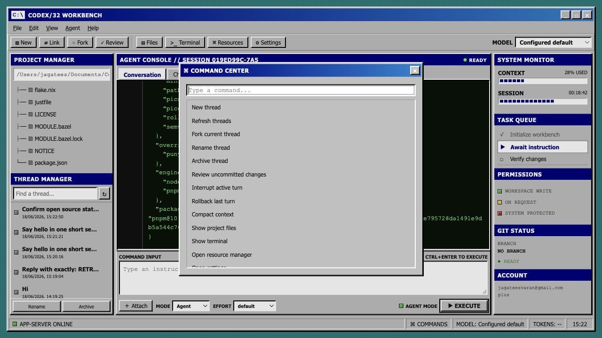

# Codex/32 Workbench

<p align="center">
  
</p>

**Codex, but it looks like 1995.**

Codex/32 is a retro desktop workbench for the [open-source Codex engine](https://github.com/openai/codex). It is not a mockup — the UI connects to your local Codex app-server and runs the real agent: threads, files, terminal output, diffs, automations, MCP, and more.

> Version 0.3 · Conventional memory: 640K

## Features

- Windows 95-style desktop shell with agent console, file tree, and terminal
- Automatic local connection to `codex app-server` (falls back to demo mode)
- Thread search, resume, fork, archive, rename, and rollback
- Review uncommitted changes, settings, models, and account status
- Automations, apps, plugins, skills, and MCP browsing
- Image attachments, tool rendering, diff view, and shell-command streaming

## Quick start

**Prerequisites:** [Codex CLI](https://github.com/openai/codex) installed and authenticated on your machine.

```sh
git clone https://github.com/Jagatees/codex-32.git
cd codex-32
npm run dev
```

Open [http://127.0.0.1:4173](http://127.0.0.1:4173).

To use the real engine, choose **Link** and keep the recommended `local://stdio` transport. The dev server launches `codex app-server` and bridges its JSON-RPC stream to the browser. Your normal Codex authentication and configuration are reused.

## How it works

The browser server binds only to `127.0.0.1`. Direct WebSocket URLs remain available for non-browser-compatible proxies, but Codex's listener rejects standard browser Origin headers.

Automations remain owned by Codex rather than duplicated in this client. The Automations button opens a dedicated chat that uses Codex's automation tools, so schedules and execution behavior stay consistent with the main app.

## License

Apache-2.0 — same as the upstream Codex project.
